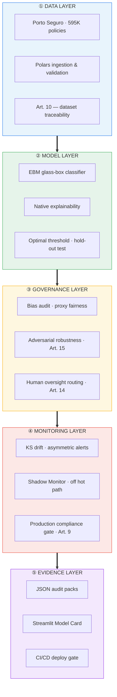
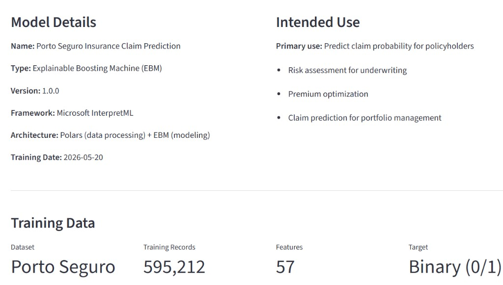
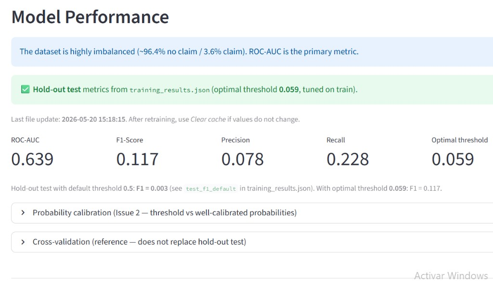
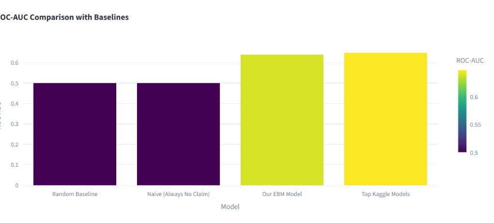
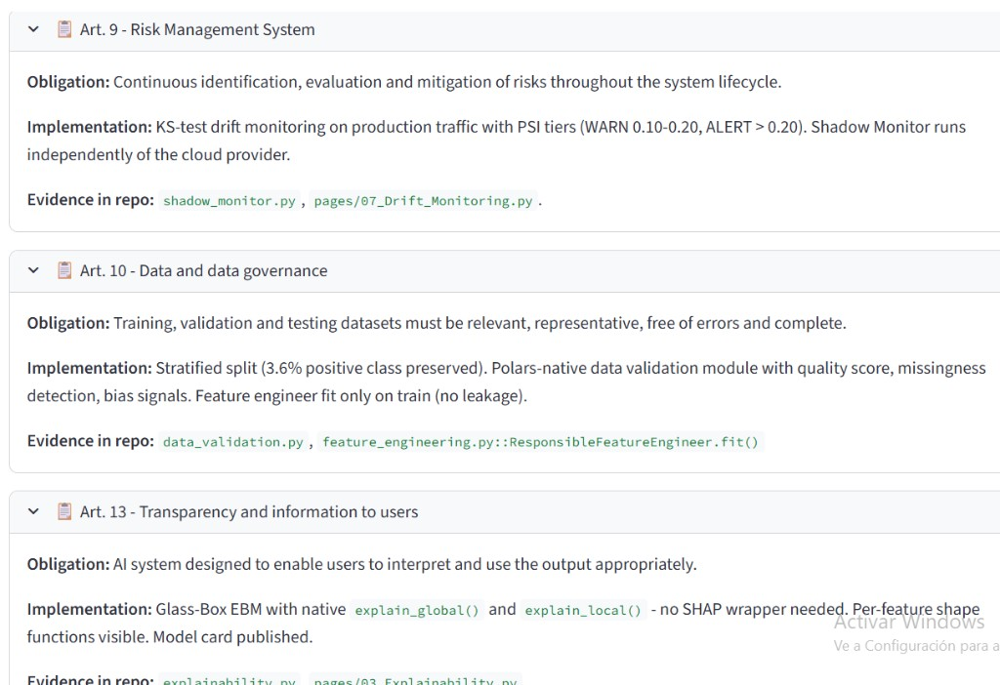
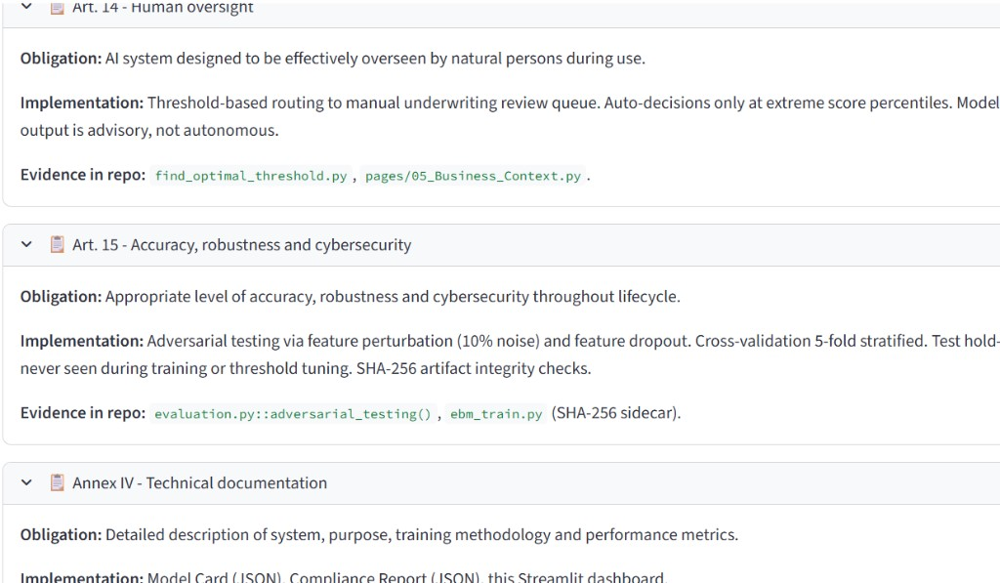
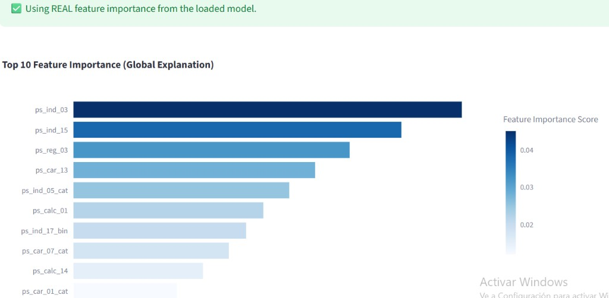
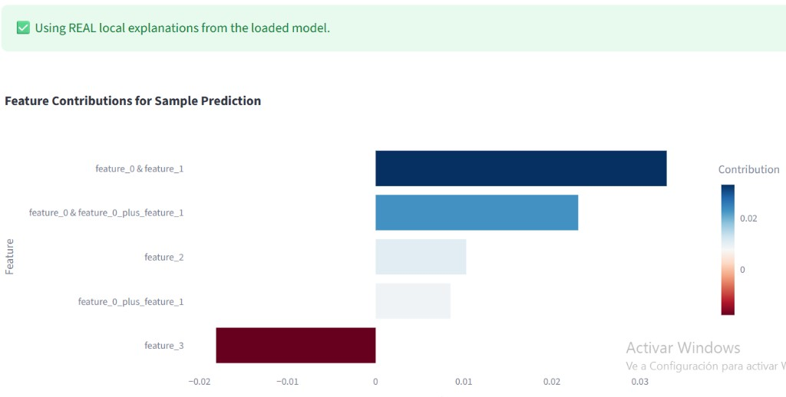
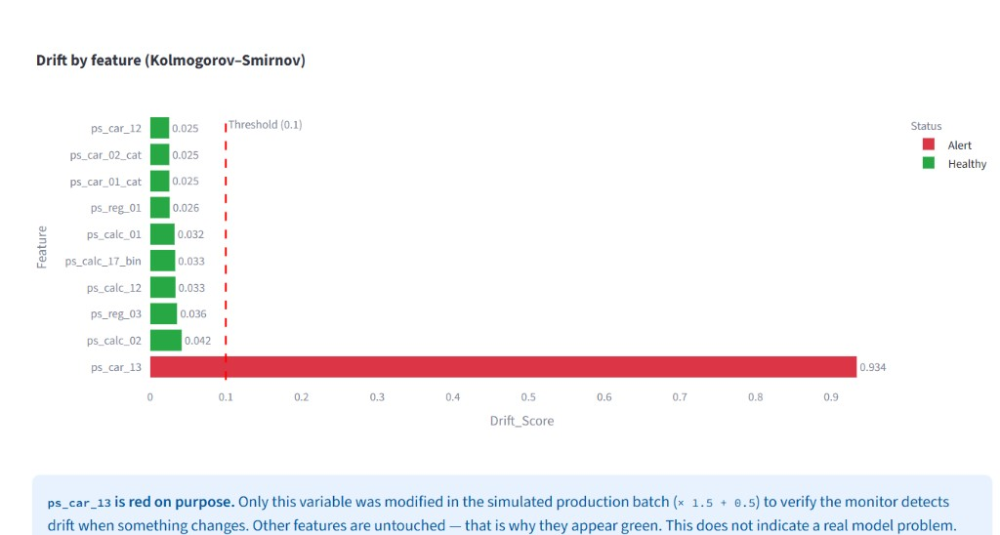
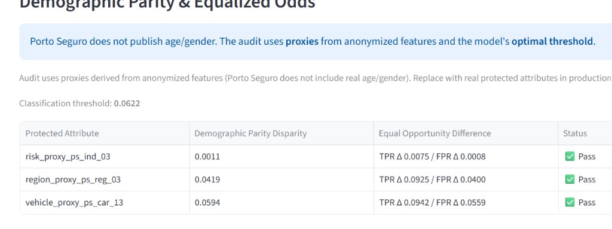

# Porto Seguro — Responsible AI Compliance Hub

> **Production-oriented Responsible AI reference architecture for highly regulated industries.** Designed to support technical due diligence and AI governance assessments from compliance, risk management, and cybersecurity stakeholders under the **EU AI Act** and **Solvency II** frameworks.

## Executive Architecture

Single-stack view for C-suite, compliance, and risk committees — five layers, one audit trail.



| Layer | Business question | Regulatory anchor |
|-------|-------------------|-------------------|
| **Data** | Is the training data complete, representative, and leakage-free? | EU AI Act **Art. 10** |
| **Model** | Can we explain every prediction to an underwriter or auditor? | EU AI Act **Art. 13** |
| **Governance** | Is the model fair, robust, and subject to human review? | **Art. 14** · **Art. 15** |
| **Monitoring** | Do we detect drift before it harms the portfolio? | EU AI Act **Art. 9** |
| **Evidence** | Can we prove compliance to regulators and Solvency II? | **Annex IV** · Solvency II |

### Threat & Governance Scope

**Threats addressed**

- Data drift
- Model degradation
- Fairness regressions
- Documentation gaps
- Auditability failures
- Human oversight failures

**Out of scope**

- Adversarial prompt injection
- Agentic AI runtime controls
- LLM security threats
- Supply-chain security

---



---

## Endpoints

| Service | Command | URL |
|---------|---------|-----|
| **Model Card Dashboard** | `streamlit run app.py` | `http://localhost:8501` |
| **Inference API Gateway** | `python api_server.py` | `http://localhost:8000` |
| **Compliance Monitor** | `POST /compliance/monitor` | `http://localhost:8000/compliance/monitor` |

---

## Reference Metrics (Hold-Out Test)



| Metric | Value | Note |
|--------|-------|------|
| **ROC-AUC** | 0.639 | Realistic Kaggle benchmark for highly imbalanced fraud/claim data. |
| **F1 @ Optimal Threshold** | **0.117** | Optimized at `0.059` vs. `0.003` at default threshold `0.5`. |
| **Precision** | 0.078 | Expected profile for imbalanced classes — ROC-AUC remains primary metric. |
| **Recall** | 0.228 | Tuned specifically for claim detection at a low-risk threshold. |
| **Accuracy** | ~87% | **Misleading** on imbalanced data — see the Business Context tab. |

### Baseline Comparison Context



| Model | ROC-AUC |
|-------|---------|
| Random baseline | 0.50 |
| Naive (always no claim) | 0.50 |
| **Our EBM model** | **0.64** |
| Top Kaggle models | ~0.65 |

> ⚠️ **Production Safeguard:** Do not use `sample_size=10000` for production metrics validation. See detailed protocols in `docs/METRIC_VALIDATION.md`.

---

## JSON Evidence for Auditors

The architecture automatically materializes audit logs into automated cryptographic evidence packs, fully matching the dashboard view:




| File | Content |
|------|---------|
| `docs/compliance_report.json` | Unified EU AI Act + Solvency II report |
| `docs/audit_results.json` | Per-pillar compliance status |
| `docs/drift_monitoring_latest.json` | Latest data drift gate check (Art. 9) |
| `docs/robustness_results.json` | Adversarial red teaming and noise tests (Art. 15) |
| `eu_ai_act_conformity_v1.json` | Exportable conformity declaration (from Compliance tab) |
| `training_results.json` | Hold-out metrics + optimal threshold parameters |
| `monitoring/performance_history.json` | Production ROC-AUC historical logs |

---

## Why This Stack for Insurance & Life Sciences

### 1. Explainable Boosting Machines (EBM)

Native glass-box explainability required by financial and clinical regulators. Eliminates unstable SHAP/LIME wrappers in production codebases.

* **Global Interpretability:** Comprehensive insight into feature importance scores across the entire population.

  

* **Local Interpretability:** Single-prediction feature contribution analysis for absolute individual assessment tracking.

  

### 2. High-Performance Data Processing (Polars)

Processes the 595K rows training set instantly with an architectural headroom design ready for a 10× production scaling factor without pipeline refactoring.

### 3. Asymmetric Drift Guardrails

Provides actionable alerts using robust Kolmogorov-Smirnov test gates. Isolates structural shifts from harmless variance to avoid alert fatigue.



| Feature | Drift score | Status |
|---------|-------------|--------|
| `ps_car_12` … `ps_calc_02` | 0.025 – 0.042 | Healthy |
| **`ps_car_13`** (simulated shift) | **0.934** | **Alert** |

### 4. Privacy-by-Design Fairness Optimization

Performs automated proxy-based bias audits when sensitive demographic variables cannot be explicitly collected under strict privacy regulations.



| Protected attribute (proxy) | Demographic parity disparity | Equal opportunity | Status |
|-----------------------------|------------------------------|-------------------|--------|
| `risk_proxy_ps_ind_03` | 0.0011 | TPR Δ 0.0075 / FPR Δ 0.0008 | Pass |
| `region_proxy_ps_reg_03` | 0.0419 | TPR Δ 0.0925 / FPR Δ 0.0400 | Pass |
| `vehicle_proxy_ps_car_13` | 0.0594 | TPR Δ 0.0942 / FPR Δ 0.0559 | Pass |

---

## Project Structure

```
porto-seguro/
├── app.py                          # Streamlit Model Card entrypoint
├── api_server.py                   # FastAPI + compliance monitor
├── Dockerfile / docker-compose.yml # Container packaging
├── run_training.py                 # Full MLOps pipeline
├── run_production_monitor.py       # Recurring Art. 9 monitor
├── eu_ai_act_conformity_v1.json    # Exportable conformity declaration
├── src/
│   ├── data_processing/            # Polars: load, FE, validation
│   ├── models/                     # EBM, evaluation, explainability
│   ├── governance/                 # Bias audit, reporting_generator
│   └── monitoring/                 # Drift, production gate, tracker
├── pages/                          # Overview, Performance, Compliance, Drift…
├── docs/                           # JSON reports and technical guides
└── models/artifacts/               # Model, FE, threshold, SHA-256
```

---

## Quick Start

```bash
pip install -r requirements.txt
pip install -r requirements_streamlit.txt

# Place train.csv (Kaggle Porto Seguro) in project root
python run_training.py
python run_production_monitor.py --refresh-audit
streamlit run app.py
```

> **GitHub clone:** `train.csv`, model `.pkl` files, and generated JSON reports are gitignored. After cloning, add the dataset and run the pipeline above.

---

## References

- [Porto Seguro — Kaggle](https://www.kaggle.com/c/porto-seguro-safe-driver-prediction)
- [Microsoft InterpretML / EBM](https://github.com/interpretml/interpret)
- [EU AI Act — High-risk AI systems](https://artificialintelligenceact.eu/)
- [Polars](https://pola-rs.github.io/polars/)

---

## Let's Talk

This project is a **production-oriented Responsible AI reference architecture** for regulated industries — designed to support technical due diligence and AI governance assessments from compliance, actuarial, and cybersecurity stakeholders.

- **Demo:** `streamlit run app.py` — walk through the Compliance Hub live
- **Evidence pack:** `eu_ai_act_conformity_v1.json`
- **Contact:** [Andrés Lage Freire on LinkedIn](https://www.linkedin.com/in/andres-lage-freire-4562a91b1) · open an issue in this repository

---

*Responsible AI demonstration project · EU AI Act & Solvency II compliance · Polars + EBM architecture*
